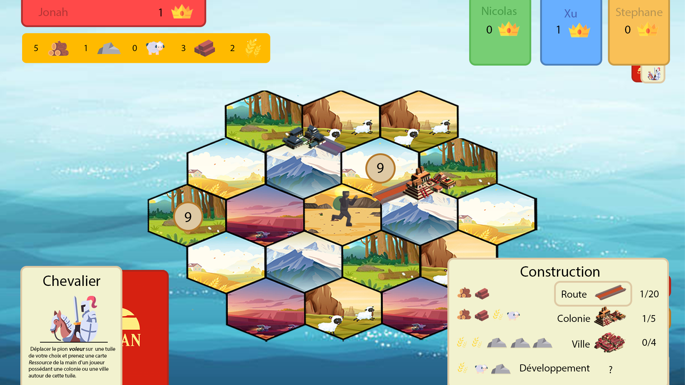
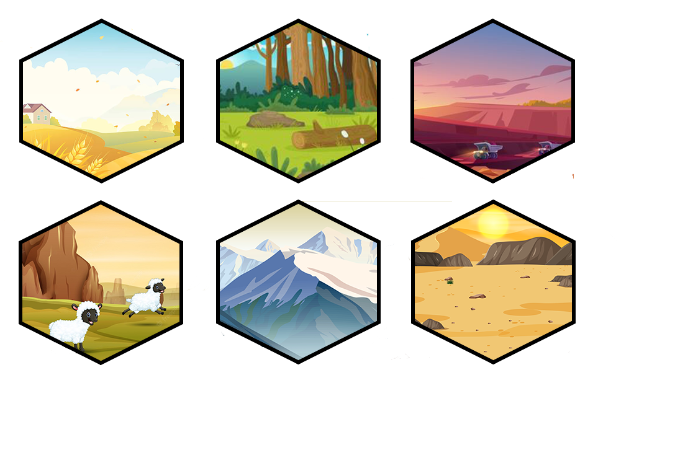
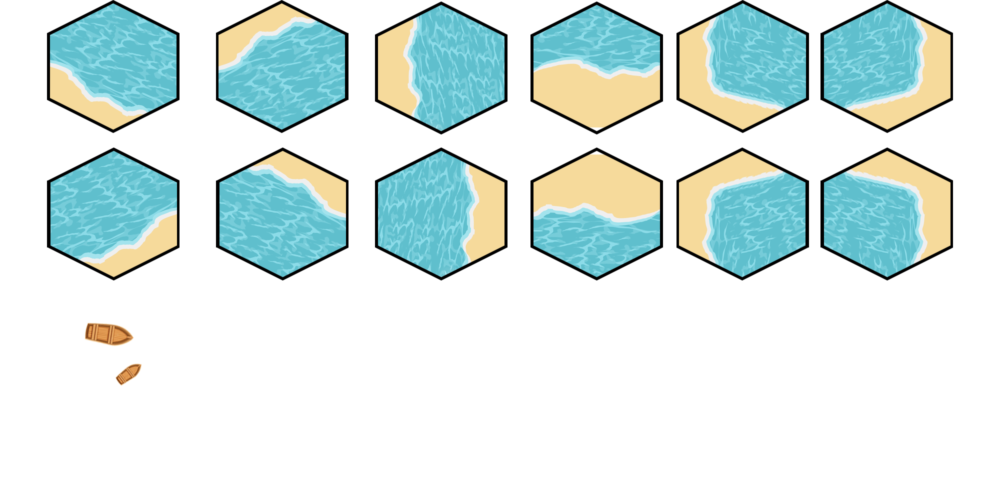
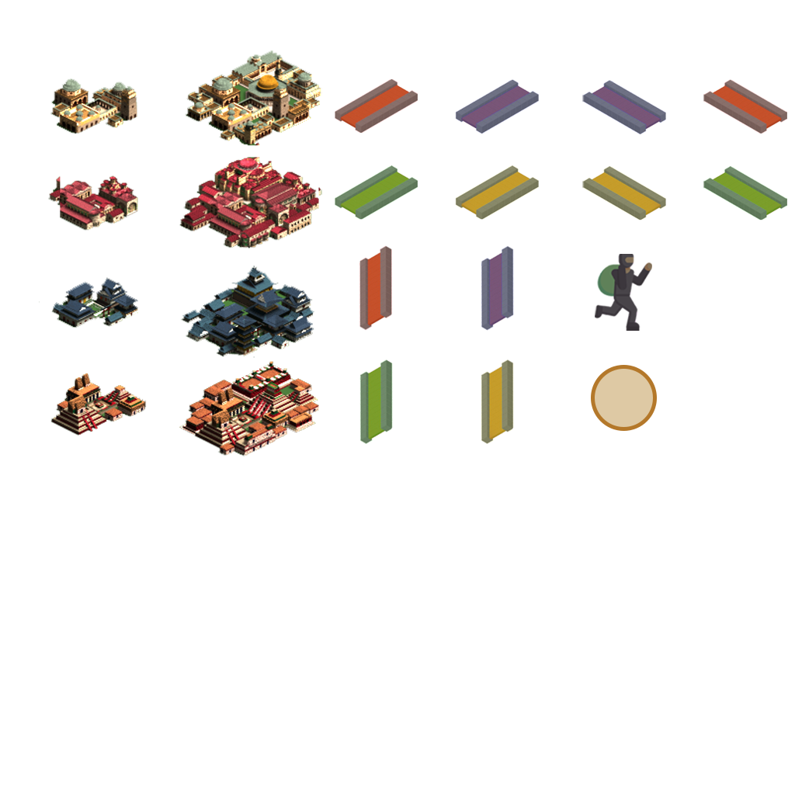
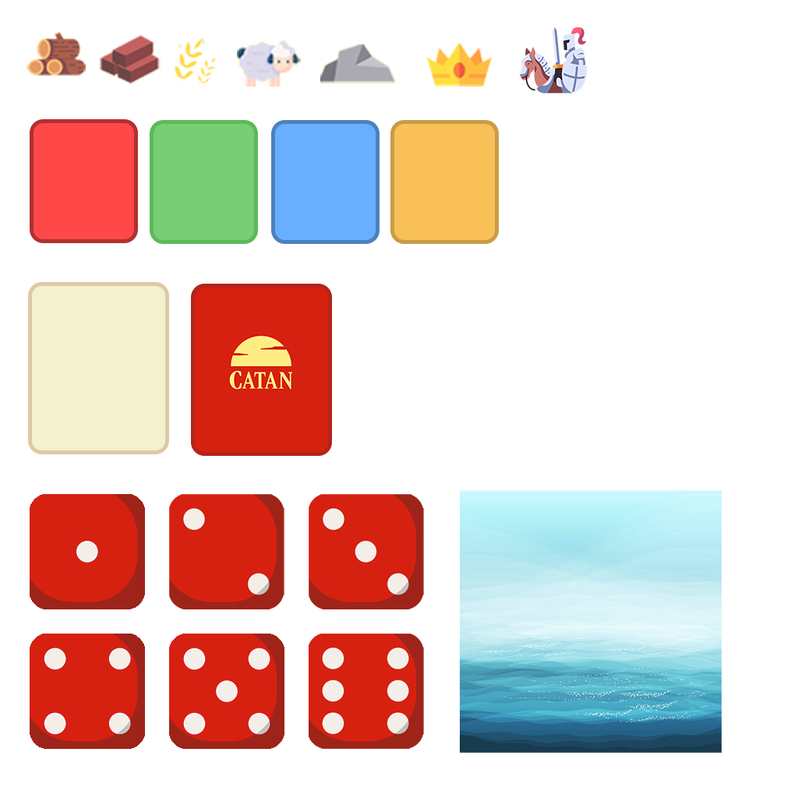

# Projet Logiciel Transversal : Catan

## __Somaire__

1. [__Présentation générale__](#présentation-générale)
    1. [Règles du jeu](#règles-du-jeu)
    2. [Ressources](#ressources)

## __Présentation Générale__

### __Règles du jeu__

&emsp;Catan est un jeu de stratégie au tour par tour où 4 joueurs s’affrontent. Le but est d’obtenir un total de __10 points de victoire__. Les joueurs évoluent sur une carte à tuiles hexagonales disposant chacune d’un __terrain__ correspondant à une __ressource__ particulière. Pour amasser des points de victoire, chaque joueur devra construire des colonies et/ou des villes ou remplir des __conditions spéciales__ (ex: plus longue route construite, armée la plus puissante, etc…).

#### <ins>Mise en place</ins> :
&emsp;Avant le début de la partie, chaque joueur dispose d’une fiche de construction ainsi que plusieurs pièces de jeu de la couleur de son choix: 5 __colonies__, 4 __villes__ et 15 __routes__. En début de partie, chacun doit placer 2 de ses __colonies__ et 2 de ses __routes__ sur le plateau; les colonies doivent être placées à une intersection entre 3 terrains du plateau ou près de la mer, tandis que les __routes__ sont placées sur les chemins, côtés communs entre 2 tuiles, ou près de la mer, et servent à relier les __colonies__ entre elles. Chaque joueur se voit attribuer des ressources correspondant aux terrains entourant ses colonies, et commence la partie avec ces ressources. On place le jeton Voleur sur le terrain désert au milieu du plateau.

#### <ins>Déroulement de partie</ins> :
&emsp;Le joueur débute son tour en lançant les 2 dés. Toutes les tuiles __Terrain__ possédant un jeton numéroté identique à la somme des dés produisent des ressources. Les joueurs obtiennent donc 1 ressource correspondante pour chaque __colonie__ placée sur un sommet des tuiles gagnantes (__2__ si c’est une __ville__).  
&emsp;Le joueur a ensuite la possibilité de construire s’il en a les __ressources__ nécessaires une route, une colonie ou une __ville__. Il peut aussi dépenser ses __ressources__ afin d’obtenir une carte développement.  
* __Route__ : Elles ne peuvent être placées que sur les chemins et à partir d’une route ou d’une colonie préexistante du joueur.
* __Colonie__ : Elles doivent être construites à côté d’une route du joueur, être à un minimum de 2 chemins de la colonie la plus proche, et ne pas être adjacentes à quelconque autre colonie/ville (quel que soit le joueur). On ne peut pas avoir plus de 5 colonies en même temps. Une colonie vaut __1 point de victoire__.
* __Ville__ : Ce sont des améliorations des colonies préexistantes. Lorsqu’une colonie est améliorée en ville, le joueur récupère sa colonie. Une ville vaut __2 points de victoire__.
* __Développement__ : Les cartes développement sont variées. Chacune à un effet qui peut être déclenché par le joueur instantanément ou plus tard mais toujours durant son tour. Il existe différents effets permettant de retourner le cours de la partie.

Le joueur peut construire plusieurs éléments dans le même tour.

Le joueur peut également procéder à des échanges durant son tour que ce soit avec la banque ou avec les autres joueurs. Pour la banque le coût est de 4 Ressources contre 1 (__4:1__). Ce coût peut être diminué avec l'utilisation des ports. Les ports classiques permettent un échange de rapport __3:1__. Les ports spécialisés (une seule __ressource__) permettent un échange de rapport __2:1.__

#### <ins>Cas particulier</ins> : 

Si un joueur qui lance les dés obtient 7, personne n’obtient de ressources. Tous les joueurs possédant __plus de 7 ressources__ doivent défausser la moitié de leurs __ressources__ arrondis à l’entier le plus faible.
Le joueur qui vient de lancer les dés doit déplacer le pion voleur sur une nouvelle tuile, ce terrain ne produira donc plus de ressources tant que le voleur est dessus. Ensuite, il pioche une ressource au hasard parmi un des joueurs qui possède une colonie ou une ville sur l’un des sommets de ce terrain.

#### <ins>Les développements</ins> :

Carte chevalier : 
* Le joueur qui joue une carte Chevalier déplace le pion __Voleur__.
* Les cartes Chevalier jouées restent visibles devant leur propriétaire.

Carte Progrès :  
* Le joueur qui utilise une telle carte réalise les instructions mentionnées sur la carte. Ensuite, la carte est défaussée du jeu.

Points de Victoire :  
* Les cartes Point de Victoire sont gardées secrètes. Elles sont dévoilées lorsqu’un joueur possède un total d’au moins 10 points de victoire.

#### <ins>Bonus</ins> : 
* __Plus grande route__ : le joueur qui a la route continue la plus longue (à partir de 5 routes) se voit attribuer cette carte. __+2 points de victoire__. Si un joueur le dépasse, ce dernier récupère la carte et se voit attribuer les points.
* __Plus grande armée__ : le joueur qui a la plus grande armée (à partir de __3 chevaliers__, carte disponible parmi les __développements__) se voit attribuer cette carte. __+2 points de victoire__. Si un joueur le dépasse, ce dernier récupère la carte et se voit attribuer les points.

#### <ins>Condition de victoire</ins> :

Le premier joueur qui durant son tour atteint __10 points de victoire__ ou plus remporte la partie.

### __Ressources__

Premier aperçu de l’interface en jeu ci dessous :

<!---  --->

Les terrains :

les terrains plages :

Les éléments du plateau :

Les ressources :

